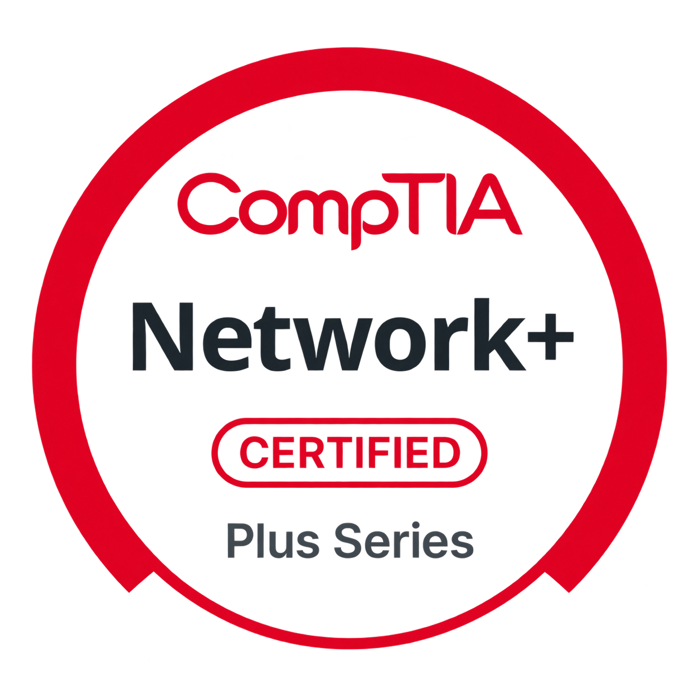

# Tyteonna Singletary: Portfolio 👩🏽‍💻

  
  

I'm a cybersecurity student and U.S. Army veteran with a foundation in systems support, networking, and security fundamentals — CompTIA A+ and Network+ certified and currently preparing for Security+. I'm pursuing an A.S. in Cybersecurity and expanding my knowledge of Azure, Microsoft Defender, and Microsoft Sentinel while developing practical skills through home labs related to these areas of study.

---

## 🛠️ Skills

| Category | Skills / Tools |
| --- | --- |
| **Systems Support** | Windows, computer hardware, software troubleshooting, technical documentation |
| **Networking** | TCP/IP, IPv4 addressing, DNS, DHCP, connectivity testing |
| **Network Traffic Analysis** | Wireshark, packet inspection, TCP stream analysis |
| **Service Discovery** | Nmap, port scanning, service and version identification |
| **Virtualization** | VirtualBox, virtual machine configuration, host-only networking |
| **System Hardening** | Windows Firewall, Secure Boot checks, BitLocker configuration |
| **Cloud & Security Operations — Currently Learning** | Azure, Microsoft Defender, Microsoft Sentinel |
| **Identity & Access Management — Currently Learning** | Windows Server, Active Directory |

---

## 🔬 Cybersecurity Home Labs

- [Network Service Discovery and Traffic Analysis](https://github.com/Tytevibes/cybersecurity-home-labs/tree/main/labs/kali-metasploitable) — Virtual lab setup, troubleshooting, Nmap scanning, Wireshark analysis, and Windows host security.

---

## 🎓 Education & Certifications

- **CompTIA A+** — Certified
- **CompTIA Network+** — Certified
- **CompTIA Security+** — In progress
- **A.S. in Cybersecurity** — St. Petersburg College, in progress
- ---

## 🤝 Connect With Me

<!--
**Tytevibes/Tytevibes** is a ✨ _special_ ✨ repository because its `README.md` (this file) appears on your GitHub profile.

Here are some ideas to get you started:

- 🔭 I’m currently working on ...
- 🌱 I’m currently learning ...
- 👯 I’m looking to collaborate on ...
- 🤔 I’m looking for help with ...
- 💬 Ask me about ...
- 📫 How to reach me: ...
- 😄 Pronouns: ...
- ⚡ Fun fact: ...
-->
